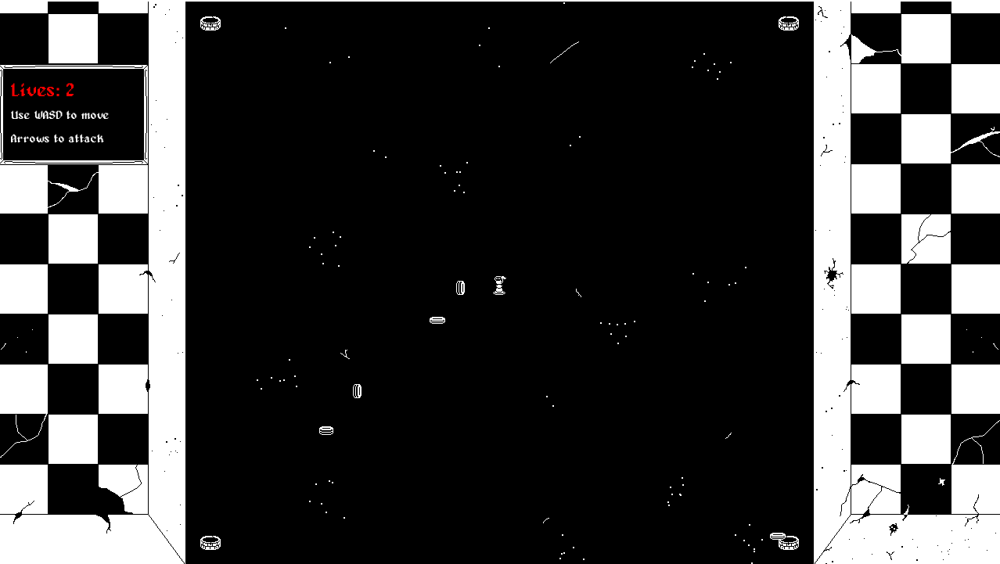

# Killer's Queen ♛



Um protótipo de jogo no estilo "Vampire Survivors-like" desenvolvido com PyGame Zero, onde você controla o último peão do tabuleiro em uma batalha contra rainhas-damas.

## 🎮 Como Jogar

### Controles:
- **WASD**: Movimentação do peão
- **Teclas de seta**: Ataque na direção correspondente
- **ESC**: Voltar ao menu principal
- **Mouse**: Seleção de opções no menu

### Mecânicas:
- Você começa com 3 vidas
- Cada colisão com uma rainha inimiga reduz uma vida
- Ataque as rainhas usando sua espada
- Sobreviva o máximo que puder!

## 🛠️ Funcionalidades Atuais

✅ Tela de título interativa  
✅ Sistema de vidas e dano  
✅ Inimigos com IA simples de perseguição  
✅ Sistema de ataque em 4 direções  
✅ Animações para personagens  
✅ Opção para ligar/desligar som  

## 🔮 Roadmap (Planos Futuros)

- [ ] Sistema de pontuação baseado no tempo de sobrevivência
- [ ] Mais tipos de inimigos
- [ ] Power-ups e habilidades especiais
- [ ] Fases adicionais
- [ ] Melhorias visuais e de UI

## ⚙️ Requisitos e Instalação

1. Certifique-se de ter Python 3 instalado
2. Instale o Pygame Zero:
   ```bash
   pip install pgzero
3. Baixe os arquivos do jogo
4. Execute o jogo com:
   ```bash
   pgzrun game.py

♟️ Boa sorte, peão! Sua rainha te espera... para destruí-lo! ♟️
